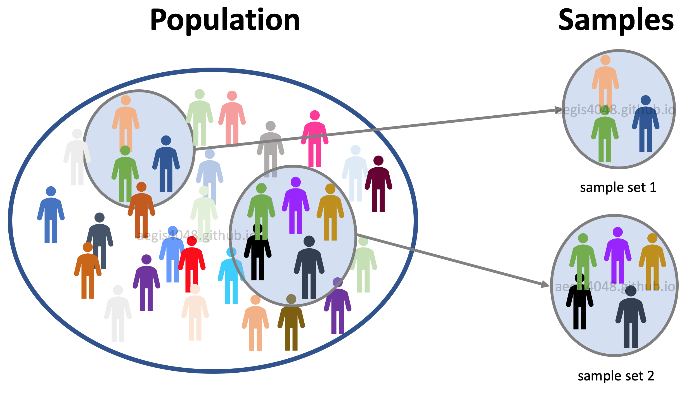

```{r setup, include = FALSE}
knitr::opts_chunk$set(echo = FALSE)

## Custom functions


#' Generate sample means from normal distribution
#'
#' @param inSampleSz an integer, sample size.
#' @param inSampleN an integer, number of samples.
#' @param inMn a float, mean of the normal distribution.
#' @param inSD a float, sd of the normal distribution.
#'
#' @return a vector.
#' @export
#'
#' @examples
fGenSamples = function(inSampleSz, inSampleN,
                       inMn, inSD) {
  sapply(1:inSampleN, 
         function(x) 
           mean(rnorm(inSampleSz, inMn, inSD)))
}

fPlotSamples = function(inSampleSz, inSampleN, 
                        inMn, inSD,
                        ...) {
  locV = fGenSamples(inSampleSz, inSampleN, inMn, inSD)
  
  hist(locV, 
       freq = F, 
       xlim = c(3,7), 
       breaks = seq(3, 7, .25),
       main = sprintf("%d FOVs, %d cells per FOV", inSampleN, inSampleSz), 
       xlab = "Mean FI in a FOV",
       ...)
  abline(v = inMn, col = "#de3765", lty = 2, lwd = 2)
}

#' Plot t-distribution with a shaded region
#'
#' The x-axis is transformed according to $x' = \frac{\bar{x} - \mu}{s / \sqrt{n}}$, 
#' where $\bar{x}$ is the sample mean, $s$ is the standard deviation of the sample,
#' $n$ is the sample size, and $\mu$ is the expected mean of the population.
#' 
#' @param nSz an integer, sample size.
#' @param nMn a float, population mean for x-axis transformation.
#' @param nSD a float, sample sd for x-axis transformation.
#' @param vertLines a vector with x coordinates of vertical dashed lines.
#' @param vertLinesCol a vector with colours for vertical lines.
#' @param nFrac a float, fraction of the distribution to shade.
#' @param xlim a two-element vector with x-axis limits.
#' @param xn an integer with the number of points on the x-axis.
#' @param inv logical, FALSE => inner region of the distribution is shaded; TRUE => tails of the distribution is shaded; missing => no shading
#' @param ... additional parameters passed to the `plot` function.
#'
#' @return a plot.
#' @export
#'
#' @examples
fPlotShadedTdist = function(nSz, 
                            nMn, nSD, 
                            vertLines, vertLinesCol, 
                            nFrac, 
                            xlim, 
                            xn = 100, inv, ...) {
  
  x = seq(xlim[1], xlim[2], (xlim[2] - xlim[1])/xn )
  xT = (x - nMn) / (nSD / sqrt(nSz))
  y = dt(xT, df = nSz-1)
  
  plot(x, 
       y,
       type = "l",
       xlim = xlim,
       ...)
  
  if (!missing(inv)) {
    if (inv) {
      xL = qt(nFrac/2, df = nSz-1) * nSD / sqrt(nSz) + nMn
      xR = qt(1 - nFrac/2, df = nSz-1) * nSD / sqrt(nSz) + nMn
      
      polygon(c(min(x), x[x<=xL], max(x[x<=xL])), 
              c(0, y[x<=xL], 0), 
              col="grey80")
      polygon(c(x[x>=xR], max(x), min(x[x>=xR])), 
              c(y[x>=xR], 0, 0), 
              col="grey80")
    } else {
      xL = qt((1-nFrac)/2, df = nSz-1) * nSD / sqrt(nSz) + nMn
      xR = qt((1 + nFrac)/2, df = nSz-1) * nSD / sqrt(nSz) + nMn
      
      polygon(c(min(x[x>=xL]), x[x>=xL & x<=xR], max(x[x<=xR])), 
              c(0,             y[x>=xL & x<=xR], 0), 
              col="grey80")
    }
  }
  
  if (!missing(vertLines) & !(missing(vertLinesCol))) {
    abline(v = vertLines, 
           col = vertLinesCol, 
           lty = 2, lwd = 2)
  }
  
}

```

## About {.normal}

This lecture is based on the [Minitab Blog](https://blog.minitab.com/en/adventures-in-statistics-2/understanding-hypothesis-tests-why-we-need-to-use-hypothesis-tests-in-statistics) series.

The presentation is prepared with [R Markdown](https://bookdown.org/yihui/rmarkdown/ioslides-presentation.html). The source code is available on [GitHub](https://github.com/dmattek/CrashCourse-stats).

Other resources:

* [Comprehensive Confidence Intervals for Python Developers](https://aegis4048.github.io/comprehensive_confidence_intervals_for_python_developers#population_vs_samples)
* [Using t-tests in R](https://statistics.berkeley.edu/computing/r-t-tests)
* [Everything You Need To Know about Hypothesis Testing](https://towardsdatascience.com/everything-you-need-to-know-about-hypothesis-testing-part-i-4de9abebbc8a)

## Why We Need Hypothesis Tests? {.bigger}

> A hypothesis test evaluates two mutually exclusive statements about a **population** to determine which statement is best supported by the **sample** data. 

> - What does statistical significance mean?
> - What is a p-value?
> - How to interpret confidence intervals?
> - How to tests hypotheses?

# Population vs Sample

---

How well a sample statistic estimates an underlying population parameter?

<div class="centered">
{width=80%}
</div>

## Population

> - Let's measure the mean fluorescence intensity (FI) of cells subject to a treatment. 
> - The FI in single cells varies across the population and follows a distribution with $\mu = 5$ (mean).

<div class="centered">
```{r, fig.height=4}
nPopMn = 5.
nPopSD = 1.

{
  plot(function(x) dnorm(x, mean = nPopMn, sd = nPopSD), 0, 10,
       xlab = "Fluorescence intensity in single cells",
       ylab = "Density")
  abline(v = 5, lty = 2, lwd = 2, col = "#de3765")
  legend(0, 0.4,
         legend = "Population\nmean",
         lwd = 2, lty = 2,
         col = "#de3765", bty = "n")
}
```
</div>

## Sample

<div class='left' style='float:left;width:45%'>
> - We're interested in estimating the mean FI in the cell **population**. 
> - In experiments we cannot *access* the true population mean unless we measure everything. 
> - *Sampling* the reality is the next best thing we can do!


> - A sample consists of measurements of FI in individual cells.
> - A sample mean is the mean calculated from a sample.
</div>

<div class='right' style='float:right;width:45%'>
{width=100%}
</div>

## Sample vs population statistic

<div class='left' style='float:left;width:45%'>
> - Let's measure FI in 6 different fields of view (FOV), with 10 cells in each FOV. 
> - We calculate the mean FI for every FOV and obtain 6 sample means.
> - The mean FI from each FOV is usually far from the population mean (=5)!
> - 
```{r}
vMeas1Sample = fGenSamples(10, 6, nPopMn, nPopSD)

library(kableExtra)
vMeas1Sample %>%
  kbl(col.names = "Sample mean") %>%
  kable_paper(full_width = F)
```
</div>

<div class='right' style='float:right;width:45%'>

```{r, fig.width=4.5, fig.height=4}
library(ggplot2)

nPopSz = 300
myDF = data.frame(x = runif(nPopSz),
                  y = runif(nPopSz),
                  z = rnorm(nPopSz, nPopMn, nPopSD)) 

vXrect = c(0.1, 0.1, 0.4, 0.4, 0.7, 0.7)
vYrect = c(0.2, 0.6, 0.2, 0.6, 0.2, 0.6)
myRect = data.frame(xmin = vXrect,
                    xmax = vXrect + .2,
                    ymin = vYrect,
                    ymax = vYrect + .2)

ggplot() +
  geom_jitter(data = myDF,
              aes(x = x,
                  y = y,
                  color = z), 
              size = 2, width = 0.05, height = 0.05) +
  geom_rect(data = myRect,
            aes(xmin = xmin,
                xmax = xmax,
                ymin = ymin,
                ymax = ymax),
            color = "black",
            fill = NA) +
  scale_color_distiller("FI", palette = "RdYlBu") +
  coord_fixed(ratio = 1) +
  xlab("") +
  ylab("") +
  theme_dark() +
  theme(axis.ticks = element_blank(),
        axis.text = element_blank(),
        panel.grid.major = element_blank(), 
        panel.grid.minor = element_blank())
```

> - For any random sample, the sample mean almost certainly doesn't equal the true mean of the population due to **sampling error**. 
</div>

## Sampling distribution

<div class='left' style='float:left;width:48%'>
> - Let's sample our biological process multiple times (e.g. by recording multiple FOVs) but at different magnifications such that we have a different number of cells per FOV. 
> - From each sample (=FOV) we calculate a sample mean FI.
</div>

<div class='right' style='float:right;width:48%'>
> - Explore interactively on the next slide.
</div>

---

Histogram of sample means.

```{r echo = FALSE}
# Histogram of sample mean
shinyAppDir(appDir = "statsBasics-apps/sampleMeanHist",
            options = list(width = "100%", height = 700)
)
```

## Sampling distribution II

<div class='left' style='float:left;width:48%'>
> - A **sampling distribution** is the distribution of a statistic, such as the **mean**, that is obtained by repeatedly drawing a large number of samples from a specific population. 
> - This distribution allows you to determine the probability of obtaining the **sample statistic**.
</div>

<div class='right' style='float:right;width:48%'>
```{r, fig.height=5, fig.width=5}
{
  par(mfrow = c(2,1))
  fPlotSamples(5, 100, nPopMn, nPopSD)
  fPlotSamples(50, 10, nPopMn, nPopSD)
}
```
</div>

## Sampling distribution III

<div class='left' style='float:left;width:48%'>
> - Fortunately, we can create a plot of the distribution of sample means without collecting many different random samples! 
> - Instead, we’ll create a probability distribution plot using the [t-distribution](https://en.wikipedia.org/wiki/Student%27s_t-distribution).
</div>

<div class='right' style='float:right;width:48%'>
```{r, fig.height=5, fig.width=5}
x = seq(3, 7, 0.01)

nSz1 = 5
nSampleSD1 = sd(rnorm(nSz1, mean = nPopMn, sd = nPopSD))

nSz2 = 50
nSampleSD2 = sd(rnorm(nSz2, mean = nPopMn, sd = nPopSD))

# Convert the x-axis to t-value
xT1 = (x - nPopMn) / (nSampleSD1 / sqrt(nSz1))
y1 = dt(xT1, df = nSz1 - 1)

xT2 = (x - nPopMn) / (nSampleSD2 / sqrt(nSz2))
y2 = dt(xT2, df = nSz2 - 1)

{
  plot(x, y1,
       main = "Sampling distribution",
       xlab = "Fluorescence intensity",
       ylab = "Density", 
       type = "l",
       xlim = c(3,7),
       ylim = c(0, 0.4))
  lines(x, 
        y2,
        col = "#de3765")
  legend(3, 0.4,
         legend = c(nSz1, nSz2),
         title = "Sample size",
         col = c("#000000", "#de3765"),
         lty = c(1,1), bty = "n")
}
```
</div>

## Student's t-distribution

<div class='left' style='float:left;width:48%'>
> - A normal distribution describes a full population. T-distributions describe samples drawn from a full population.
> - The t-distribution differs for each sample size. The larger the sample, the more it resembles a normal distribution.
> - $$ t = \frac{\bar{x} - \mu}{s / \sqrt{n}} $$
> - Where, $\bar{x}$ is the mean, $s$ standard deviation, $n$ size of the **sample**. $\mu$ is the expected mean of the **population**.
</div>

<div class='right' style='float:right;width:48%'>
```{r, fig.width=5, fig.height=5}
{
  plot(xT1, dt(xT1, df = 1),
       main = "Student's t-distribution",
       xlab = "t-value",
       ylab = "Density", 
       type = "l",
       ylim = c(0, 0.4))
  lines(xT1, dt(xT1, df = 4), col = "#de3765")  
  lines(xT1, dt(xT1, df = 9), col = "#7cb5ec")
  lines(xT1, dnorm(xT1), col = "#000000", lty = 2)
  legend(min(xT1), 0.4,
         legend = c(2, 5, 10, "normal"),
         title = "Sample size",
         col = c("#000000", "#de3765", "#7cb5ec", "#000000"),
         lty = c(1,1,1,2), bty = "n")
}
```
</div>

# Statistical significance

## Significant difference

<div class='left' style='float:left;width:48%'>
> - Let's move to another well. This time we measured the FI of 5 cells, which yielded the mean 6.5.
> - Is the new sample mean *significantly different* from the population mean?


> - There is no magic place on the distribution to determine *significant difference*. 
> - We have a continuous decrease in the probability of obtaining sample means that are farther from the population mean. 
> - Where to draw the line?
</div>

<div class='right' style='float:right;width:48%'>
```{r, fig.height=5, fig.width=5}
nPopMn = 5.
nSampleMn = 6.5
nSampleSD = 1.1
nSz = 5

{
  fPlotShadedTdist(nSz = nSz, nMn = nPopMn, nSD = nSampleSD, 
                   vertLines = c(nPopMn, nSampleMn), 
                   vertLinesCol = c("#de3765", "#7cb5ec"),
                   xlim = c(2,8), 
                   main = sprintf("Sampling distribution, size = %d", nSz),
                   xlab = "Fluorescence intensity",
                   ylab = "Density")  
  legend(2, 0.37,
         legend = c("Population", "Sample"),
         col = c("#de3765", "#7cb5ec"),
         lty = c(2,2), lwd = c(2,2), bty = "n")
}
```
</div>

## Unusuality 

How *unusual* is our new sample mean? Let's set various thresholds for *unusuality*. 

The shaded region indicates the probability of finding the sample mean FI.

<div class="centered">
```{r plot-3thres, fig.height=3}
{
  par(mfrow = c(1,3))
  fPlotShadedTdist(nSz = nSz, nMn = nPopMn, nSD = nSampleSD, 
                   vertLines = c(nPopMn, nSampleMn), 
                   vertLinesCol = c("#de3765", "#7cb5ec"),
                   nFrac = 0.1, xlim = c(2,8), inv = T, 
                   main = "Sampling distribution, shaded 10%",
                   xlab = "Fluorescence intensity",
                   ylab = "Density")  
  fPlotShadedTdist(nSz = nSz, nMn = nPopMn, nSD = nSampleSD, 
                   vertLines = c(nPopMn, nSampleMn), 
                   vertLinesCol = c("#de3765", "#7cb5ec"),
                   nFrac = 0.05, xlim = c(2,8), inv = T, 
                   main = "Sampling distribution, shaded 5%",
                   xlab = "Fluorescence intensity",
                   ylab = "Density")  
  fPlotShadedTdist(nSz = nSz, nMn = nPopMn, nSD = nSampleSD, 
                   vertLines = c(nPopMn, nSampleMn), 
                   vertLinesCol = c("#de3765", "#7cb5ec"),
                   nFrac = 0.01, xlim = c(2,8), inv = T, 
                   main = "Sampling distribution, shaded 1%",
                   xlab = "Fluorescence intensity",
                   ylab = "Density")  
}
```
</div>

## Threshold for unusuality

> - If our threshold for *unusuality* is 10 or 5%, then the new sample mean (=6.5) IS unusual. 

> - If our threshold for *unusuality* is 1%, then the new sample mean (=6.5) IS NOT unusual. 

<div class="centered">

`){width=75%}
</div>

# Hypothesis testing

## Formulate hypotheses

<div class='left' style='float:left;width:48%'>
This new measurement *seems* quite different from the **population** mean (=5).

> - Is it still the same treatment?
> - What are the chances of obtaining the **sample** mean (=6.5) given the **population** mean (=5)?
> - Let's formulate hypotheses!
</div>

<div class='right' style='float:right;width:48%'>
> - Null hypothesis: the population mean equals the hypothesised mean (=5)
> - Alternative hypothesis: the population mean differs from the hypothesized mean (=5)


> - By setting a threshold for *unusuality* we can reject (or not) the null hypothesis.
</div>

## Test hypotheses

<div class="centered">
`){width=75%}
</div>

The thresholds for shaded regions determine how far away our sample statistic must be from the null hypothesis value before we can say it is *unusual enough* to **reject** the null hypothesis.

## Significance level

<div class="centered">
`){width=75%}
</div>

> - These thresholds are the **significance levels**, $\alpha$. 
> - It is the probability of rejecting the null hypothesis when it is true. 
> - It's a **risk** of concluding that a difference exists when there is no actual difference.

## P-value

<div class='left' style='float:left;width:48%'>
> - We've tested the null hypothesis by looking at the *location* of our sample mean with respect to chosen *significance levels*. 
> - How to determine the statistical significance at a chosen level without looking at the graph?
> - Let's shade the probability of obtaining our sample mean (=6.5) that is **at least as extreme** in both tails of the distribution ($5 \pm 1.5$).
</div>

<div class='right' style='float:right;width:48%'>
```{r plot-pval, fig.width=5}
# Calculate the fraction of the distribution
# that corresponds to the location of the sample mean.
nFrac = 2*(1- pt( (nSampleMn - nPopMn) / (nSampleSD / sqrt(nSz1)), 
                  df = nSz-1))

{
  fPlotShadedTdist(nSz = nSz, 
                   nMn = nPopMn, nSD = nSampleSD, 
                   nFrac = nFrac, 
                   vertLines = c(nPopMn, nSampleMn),
                   vertLinesCol = c("#de3765", "#7cb5ec"),
                   xlim = c(3,7), xn = 1000, inv = T,
                   main = sprintf("Sampling distribution, shaded %.1f%%", 100*nFrac),
                   xlab = "Fluorescence intensity",
                   ylab = "Density")
  legend(3, 0.37,
         legend = c("Population", "Sample"),
         col = c("#de3765", "#7cb5ec"),
         lty = c(2,2), lwd = c(2,2), bty = "n")
}
```

</div>

## P-value II

<div class='left' style='float:left;width:48%'>
> - This shaded probability represents the likelihood of obtaining a sample mean that is **at least as extreme as** our sample mean (=6.5) in both tails of the distribution if the population mean is 5. 
> - That’s our P value!

> - When a P value is less than or equal to the chosen significance level, we **reject the null hypothesis**.
</div>

<div class='right' style='float:right;width:48%'>
`){width=100%}
</div>


# Confidence intervals

## Estimate population mean

<div class='left' style='float:left;width:48%'>
> - Let's try to estimate the population mean.
> - We sample once by measuring 5 cells.
> - 
```{r}
nSample1 = c(4.273791, 5.064480, 4.419903, 3.749903, 5.279963)
nSz1 = length(nSample1)
nSampleMn1 = mean(nSample1)
nSampleSD1 = sd(nSample1)

nSample1 %>%
  kbl(col.names = "Sample") %>%
  kable_paper(full_width = F)
```
> -
```{r, results='asis'}
cat(sprintf("Sample mean = %f", 
            nSampleMn1))
```
> - 
```{r, results='asis'}
cat(sprintf("Sample SD = %f", 
            nSampleSD1))
```
</div>

<div class='right' style='float:right;width:48%'>
```{r, fig.width=5}
{
  plot(x = NULL, y = NULL, 
       xlim = c(3, 6), ylim = c(0, .4), 
       xlab = "Fluorescence intensity",
       ylab = "")
  abline(v = nSampleMn1, 
         lty = 2, lwd = 2, 
         col = "#7cb5ec")
  legend(3, 0.4,
         legend = c("Sample\nmean"),
         col = c("#7cb5ec"),
         lty = c(2), lwd = c(2), bty = "n")
}
```
</div>


## Point estimate

<div class='left' style='float:left;width:48%'>
> - The **sample** mean is the most likely value for the **population** mean given the **information we have**.
> - It is a **point estimate**, or a *best guess*, of an unknown population mean.
> - However, it would not be unusual to obtain different sample means if we drew other random samples from the same population.
</div>

<div class='right' style='float:right;width:48%'>
```{r, fig.width=5}
{
  fPlotShadedTdist(nSz = nSz1, 
                   nMn = nSampleMn1, nSD = nSampleSD1, 
                   vertLines = nSampleMn1, 
                   vertLinesCol = c("#7cb5ec"),
                   xlim = c(3, 6), 
                   xn = 1000,
                   main = "Sampling distribution, size = 5",
                   xlab = "Fluorescence intensity",
                   ylab = "Density")
  
  legend(3, 0.4,
         legend = c("Sample\nmean"),
         col = c("#7cb5ec"),
         lty = c(2), lwd = c(2), bty = "n")
}
```
</div>


## Margin of error

<div class='left' style='float:left;width:48%'>
> - To put a number on the uncertainity of the point estimate, let's shade the inner 95% of the distribution.
> - 95% is an arbitrary but a commonly accepted typical range.
> - A specific CI represents the **margin of error**, or the amount of uncertainty, around the point estimate, which is our single sample mean.
> - A specific CI is a range of values that is **likely** to contain an unknown population parameter.
> - It is **NOT the probability** of the population mean being in THAT range!
> - The population mean is UNKNOWN but FIXED; it either is or isn't in a CI.

> - Explore interactively ono the next slide.
</div>

<div class='right' style='float:right;width:48%'>
```{r, fig.width=5}
{
  fPlotShadedTdist(nSz = nSz1, 
                   nMn = nSampleMn1, nSD = nSampleSD1, 
                   vertLines = nSampleMn1, 
                   vertLinesCol = c("#7cb5ec"),
                   nFrac = .95, 
                   xlim = c(3, 6), 
                   xn = 1000,
                   inv = F,
                   main = sprintf("95%% CI for sample mean=%.2f", nSampleMn1),
                   xlab = "Fluorescence intensity",
                   ylab = "Density")
  
  legend(3, 0.4,
         legend = c("Sample\nmean"),
         col = c("#7cb5ec"),
         lty = c(2), lwd = c(2), bty = "n")
}
```
</div>

---

Draw random samples from the **same** population. Shaded region indicates the confidence interval.

```{r echo = FALSE}
# CI in a sample distribution
shinyAppDir(appDir = "statsBasics-apps/multiSample",
            options = list(width = "100%", height = 700)
)
```


## CI in hypothesis testing

<div class='left' style='float:left;width:48%'>
> - If you draw a random sample many times (from the same population!), a certain percentage of confidence intervals will contain the population mean. 
> - This percentage is the **confidence level**!
> - In our case 95% of the time, the confidence interval WILL contain the population mean.

> - Explore interactively on the next slide.
</div>

<div class='right' style='float:right;width:48%'>

```{r, fig.width=5, fig.height=5.5}
{
  par(mfrow = c(3,2))
  fPlotShadedTdist(nSz = nSz1, 
                   nMn = 4.2, nSD = 0.71, 
                   vertLines = c(4.2, 5), 
                   vertLinesCol = c("#7cb5ec", "#de3765"),
                   nFrac = .95, 
                   xlim = c(3,7), 
                   xn = 1000,
                   inv = F,
                   xlab = "",
                   ylab = "Density")
  fPlotShadedTdist(nSz = nSz1, 
                   nMn = 3.8, nSD = 1.1, 
                   vertLines = c(3.8, 5), 
                   vertLinesCol = c("#7cb5ec", "#de3765"),
                   nFrac = .95, 
                   xlim = c(3,7), 
                   xn = 1000,
                   inv = F,
                   xlab = "",
                   ylab = "")
  fPlotShadedTdist(nSz = nSz1, 
                   nMn = 5.1, nSD = 0.97, 
                   vertLines = c(5.1, 5), 
                   vertLinesCol = c("#7cb5ec", "#de3765"),
                   nFrac = .95, 
                   xlim = c(3,7), 
                   xn = 1000,
                   inv = F,
                   xlab = "",
                   ylab = "Density")
  fPlotShadedTdist(nSz = nSz1, 
                   nMn = 4.5, nSD = 0.8, 
                   vertLines = c(4.5, 5), 
                   vertLinesCol = c("#7cb5ec", "#de3765"),
                   nFrac = .95, 
                   xlim = c(3,7), 
                   xn = 1000,
                   inv = F,
                   xlab = "",
                   ylab = "")
  fPlotShadedTdist(nSz = nSz1, 
                   nMn = 5.6, nSD = 1.2, 
                   vertLines = c(5.6, 5), 
                   vertLinesCol = c("#7cb5ec", "#de3765"),
                   nFrac = .95, 
                   xlim = c(3,7), 
                   xn = 1000,
                   inv = F,
                   xlab = "Fluorescence intensity",
                   ylab = "Density")
  fPlotShadedTdist(nSz = nSz1, 
                   nMn = 5.3, nSD = 1, 
                   vertLines = c(5.3, 5), 
                   vertLinesCol = c("#7cb5ec", "#de3765"),
                   nFrac = .95, 
                   xlim = c(3,7), 
                   xn = 1000,
                   inv = F,
                   xlab = "Fluorescence intensity",
                   ylab = "")
}
```

</div>

---

Draw random samples from the **same** population. 

Compare sample means and the corresponding CI to the population mean.

```{r echo = FALSE}
# Multiple sample drawings
shinyAppDir(appDir = "statsBasics-apps/multiCI",
            options = list(width = "100%", height = 700)
)
```

## Example of CI

From [Khan Academy](https://www.khanacademy.org/math/ap-statistics/estimating-confidence-ap/introduction-confidence-intervals/a/interpreting-confidence-levels-and-confidence-intervals):

> A baseball coach was curious about the true mean speed of fastball pitches in his league. The coach recorded the speed in kilometers per hour of each fastball in a random sample of 
100 pitches and constructed a 95%, percent confidence interval for the mean speed. The resulting interval was (110,120).


<div class="green2">Correct statement:</div>

We're 95% **confident** that the interval (110,120) captured the true mean pitch speed.

<div class="red2">Incorrect statement:</div>

> - There is a 95% **probability** that the true mean is within the (110, 120) interval.
> - About 95% of pitches in the sample **were** between 110 and 120.
> - If the coach took another sample of 100 pitches, there's a 95% **chance** the sample mean would be between 110 and 120.

## P values vs CI

<div class='left' style='float:left;width:48%'>
> - You can use either P values or confidence intervals to determine whether your results are statistically significant.
> - If a hypothesis test produces both, these results will agree.
> - The confidence level is equivalent to $1 - \alpha$.
</div>

<div class='right' style='float:right;width:48%'>
> - If the P value is less than the significance level $\alpha$, the hypothesis test is statistically significant.
> - If the confidence interval does not contain the null hypothesis value, the results are statistically significant.
> - If the P value is less than $\alpha$, the confidence interval will not contain the null hypothesis value.

> - Explore interactively on the next slide.
</div>

---

```{r echo = FALSE}
# P-value vs CI
# Two plots to show rejection based on p-value and CI

shinyAppDir(appDir = "statsBasics-apps/pVal_vs_CI",
            options = list(width = "100%", height = 700)
)
```

## P values vs CI II

<div class='left' style='float:left;width:48%'>
The **significance level** defines the distance the sample mean must be from the null hypothesis to be considered statistically significant.

```{r, fig.height=4, fig.width=5}
{
  fPlotShadedTdist(nSz = nSz, nMn = nPopMn, nSD = nSampleSD, 
                   vertLines = c(nPopMn, nSampleMn), 
                   vertLinesCol = c("#de3765", "#7cb5ec"),
                   nFrac = 0.05, xlim = c(2,8), inv = T, 
                   main = "Sampling distribution, shaded 5%",
                   xlab = "Fluorescence intensity",
                   ylab = "Density")
  
  legend(2, 0.37,
         legend = c("Population", "Sample"),
         col = c("#de3765", "#7cb5ec"),
         lty = c(2,2), lwd = c(2,2), bty = "n")
  
}
```

</div>

<div class='right' style='float:right;width:48%'>
The **confidence level** represents the percentage of intervals that would include the population parameter if you took samples from the same population again and again.

{width=100%}
</div>

## Type of errors

[What are type I and type II errors?](https://support.minitab.com/en-us/minitab/19/help-and-how-to/statistics/basic-statistics/supporting-topics/basics/type-i-and-type-ii-error/)

<div class="centered">
{width=80%}
</div>

# Pitfalls

---

<div class='left' style='float:left;width:48%'>
> - <div class="red2">The P-value is not a "score".</div>
> - <div class="red2">The P-value is NOT the probability that the null hypothesis is true.</div>
> - <div class="blue2">It is the probability of obtaining an effect at least as extreme as the one in your sample data, assuming that the null hypothesis is true.</div>
</div>

<div class='right' style='float:right;width:48%'>
> - <div class="red2">The confidence level is NOT the probability that a specific CI contains the population parameter.</div>
> - <div class="blue2">It is a range of values that is likely to contain an **unknown population parameter**.</div>
> - If you draw a random sample many times, a certain percentage of CIs will contain the population parameter. 
> - This percentage is the [confidence level](https://www.khanacademy.org/math/ap-statistics/estimating-confidence-ap/introduction-confidence-intervals/v/confidence-intervals-and-margin-of-error).
</div>
